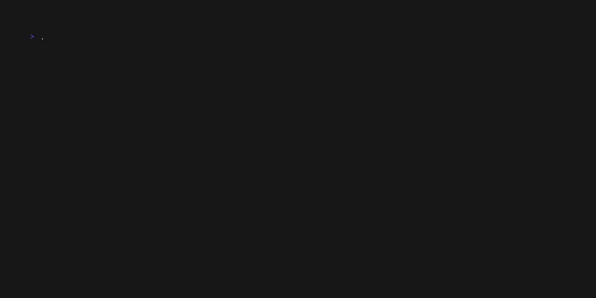

# shiny-journey

A prototype runtime agent for evidence collection and evaluation to detect compliance drift at runtime.

## Build

```bash
go build -o ./bin/ ./cmd/... 
```

## Run Demo

```bash
./bin/comply-agent
```

This will build the agent, build and deploy the dashboard, and push metrics.

```bash
make deploy
make demo
```

